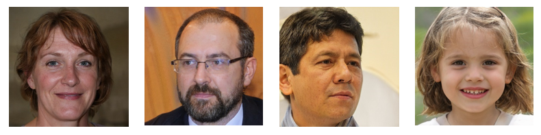

# **Система Распознования Лиц**
 &nbsp;
 &nbsp;
 &nbsp;
  

## **Описание**
Система, написанная с применением алгоритмов **машинного обучения**, предназначенная для обнаружения лиц на изображении, с последующей идентификацией личности при помощи нейросети классификатора.  
Проект был разработан в качестве индивидуального проекта для 1 курса специальности 09.02.01 "Компьютерные системы и комплексы". Полное описание теоретической и практической части проекта, а так же, списки использованной литературы, смотреть <a href="https://github.com/IgorVolochay/Face-recognition/tree/main/Documentation">**здесь**</a>.
___
## **Используемые технологии:**
* `Tensorflow / Keras`;
* `Dlib`;
* `Scikit-image`;
* `Python Imaging Library`;
* `Matplotlib`.
___
## **Обучающая и Тестовая выборка:**
Обучающая выборка состоит из 5 наборов изображений лиц. 4 из 5 наборов состоят из изображений лиц добровольцев, готовых поучаствовать в проекте. Данные наборы имеют названия:
* `Men1`;
* `Men2`;
* `Men3`;
* `Female1`.

Для создания изображений, используемых для обучения нейронной сети, были сняты 4 небольших видео, на каждого участника. Длинна каждого видео, в среднем была равна 20 секундам, с частотой смены кадров 30 FPS. При съёмке, камера плавно перемещалась, чтобы запечатлеть участников с разных ракурсов (вид по бокам, снизу и сверху).

### Пример отснятого видео:

Далее каждое видео необходимо было разбить на отдельные кадры. Для решения данной задачи был использован онлайн ресурс <a href="https://www.img2go.com/convert-to-image">img2go</a>. При использовании конвертации файла с расширением `.mp4` в `.jpg`, видеофайл разделяется на отдельные кадры, которые можно скачать одним архивом.

Помимо наборов изображений лиц 4 добровольцев, необходимо использовать некоторое количество изображений лиц случайных людей. Данный метод поспособствует улучшению точности работы модели нейронной сети. Для создания данного набора изображений был использован сайт <a href="https://thispersondoesnotexist.com/">This person does not exist</a>. Данный сайт использует алгоритмы машинного обучения для генерации изображений человеческих лиц, почти не отличимых от настоящих. Алгоритм способен генерировать изображения лиц людей разных возрастов (включая детей и пожилых людей), а также различных этнических групп.

### Пример сгенерированных изображений лиц:

___

## **Схема работы программы:**

Программа поделена на 3 логические части:

1. Поиск лиц на изображении;
2. Создание двумерной лицевой маски;
3. Определение человека исходя из двумерной лицевой маски.

**Первая** и **Вторая** решаются путём использования двух предобученных свёрточных нейронных сетей модуля <a href="http://dlib.net/">Dlib</a>. Модуль `dlib_face_recognition_resnet_model_v1` (<a href="https://github.com/ageitgey/face_recognition_models/blob/master/face_recognition_models/models/dlib_face_recognition_resnet_model_v1.dat">download</a>) ищет на изображении человеческие лица, после чего отделяет их от общей картинки. Далее модуль `shape_predictor_68_face_landmarks` (<a href="https://github.com/tzutalin/dlib-android/blob/master/data/shape_predictor_68_face_landmarks.dat">download</a>), используя выделенное изображение, создаёт двумерную лицевую маску из множества точек. Эти точки преобразуются в одномерный массив (вектор) из чисел малых разрядов.

После этого, набор чисел подаётся на вход нейронной сети **классификатору**. Модель делает предположение чьё лицо находится на изображении.

> На данный момент выходной слой нейронной сети классификатора содержит 4 нейрона (на каждого отдельного добровольца). Чем выше значение на каждом нейроне, тем больше классификатор думает, что на изображении тот или иной доброволец. Порядок присвоения нейронов добровольцам следующий: 1. `Men1`; 2. `Men2`; 3. `Men3`; 4. `Female1`. В дальнейшем, не исключается возможность полной переработки классификатора для масштабирования системы.